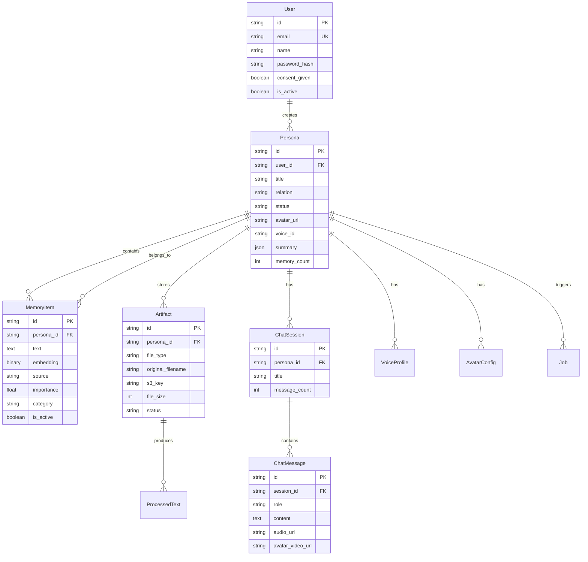
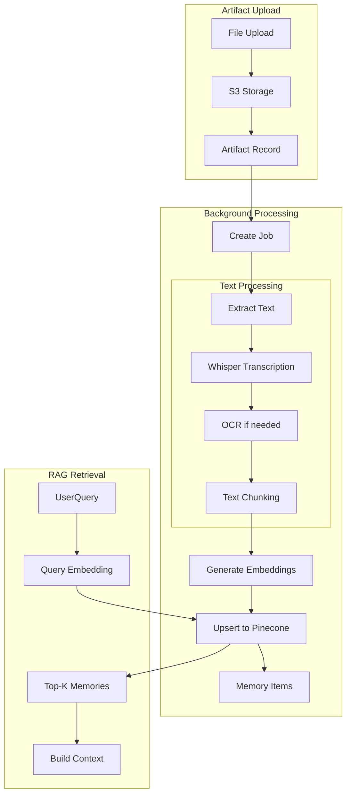
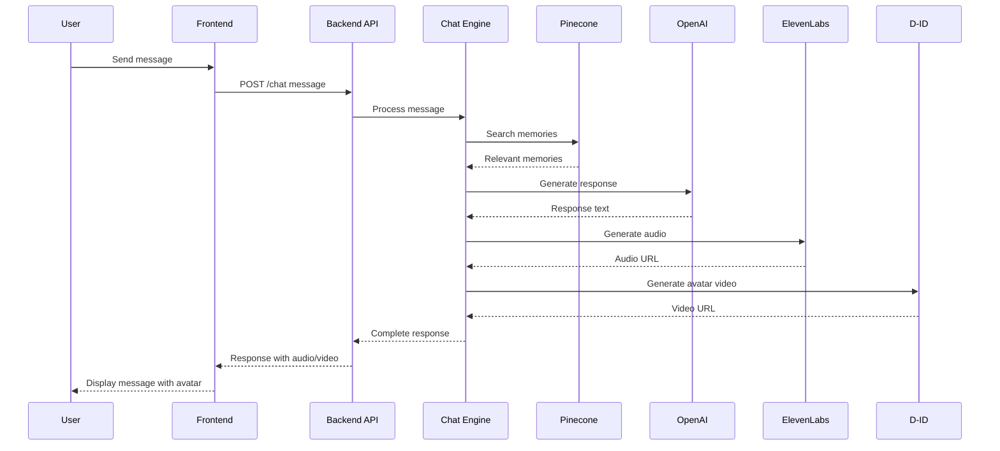

# Digital Afterlife AI Chatbot System Architecture

## Overview

The Beyond Life AI platform enables users to create AI-powered digital personas from memories, conversations, and media. The system uses RAG (Retrieval Augmented Generation) for semantic memory search, ElevenLabs for voice synthesis, and D-ID for talking avatar generation.

## System Architecture Diagram

```mermaid
flowchart TB
    subgraph Frontend [Next.js 14 Frontend]
        UI[React UI Components]
        State[State Management]
        API[API Client]
    end
    
    subgraph Backend [FastAPI Backend]
        Auth[JWT Authentication]
        Router[API Router]
        
        subgraph Endpoints
            Personas[Persona Endpoints]
            Memories[Memory Endpoints]
            Chat[Chat Endpoints]
            Voices[Voice Endpoints]
            Artifacts[Artifact Endpoints]
            Avatars[Avatar Endpoints]
        end
        
        subgraph Services
            ChatEngine[Chat Engine - RAG]
            EmbeddingService[Embedding Service]
            ElevenLabsService[ElevenLabs TTS]
            DIDService[D-ID Avatar]
            OpenAIService[OpenAI LLM]
            StorageService[S3 Storage]
            JobService[Background Jobs]
        end
    end
    
    subgraph Database [Neon PostgreSQL]
        Users[Users Table]
        Personas[Personas Table]
        Memories[Memories Table]
        Artifacts[Artifacts Table]
        Sessions[Chat Sessions Table]
        Messages[Chat Messages Table]
        Voices[Voice Profiles Table]
        Avatars[Avatar Configs Table]
        Jobs[Jobs Table]
        AuditLogs[Audit Logs Table]
    end
    
    subgraph External Services
        Pinecone[Pinecone Vector DB]
        OpenAI[OpenAI GPT-4]
        ElevenLabs[ElevenLabs API]
        DID[D-ID API]
        S3[AWS S3]
    end
    
    UI --> API
    API --> Router
    Router --> Auth
    Auth --> Endpoints
    Endpoints --> Services
    Services --> Database
    Services --> External Services
```

## Component Details

### 1. Frontend Architecture

```
frontend/src/
├── app/
│   ├── page.tsx                 # Landing page
│   ├── login/page.tsx           # Authentication
│   ├── register/page.tsx        # User registration
│   ├── dashboard/page.tsx       # User dashboard
│   ├── personas/
│   │   └── [id]/page.tsx        # Persona detail/chat page
│   ├── api/                     # Next.js API routes
│   │   ├── auth/               # Auth handlers
│   │   ├── personas/           # Persona handlers
│   │   └── voices/             # Voice handlers
│   └── layout.tsx              # Root layout
├── lib/
│   ├── api.ts                  # API client
│   └── utils.ts                # Utility functions
├── store/
│   └── index.ts                # State management
├── types/
│   └── index.ts               # TypeScript types
└── styles/
    └── globals.css            # Global styles
```

### 2. Backend Architecture

```
backend/app/
├── main.py                     # FastAPI application entry
├── api/
│   ├── router.py               # API router aggregation
│   └── endpoints/
│       ├── auth.py             # Authentication endpoints
│       ├── users.py            # User management
│       ├── personas.py         # Persona CRUD
│       ├── memories.py         # Memory management
│       ├── chat.py             # Chat sessions & messages
│       ├── artifacts.py        # File uploads
│       ├── voices.py           # Voice profiles
│       └── avatars.py          # Avatar configuration
├── core/
│   ├── config.py              # Application settings
│   └── security.py            # JWT & encryption
├── db/
│   ├── database.py            # Async database connection
│   └── models.py              # SQLAlchemy models
├── services/
│   ├── chat_engine.py          # RAG chat engine
│   ├── embedding_service.py    # Vector embeddings
│   ├── openai_service.py       # OpenAI integration
│   ├── elevenlabs_service.py  # Voice synthesis
│   ├── did_service.py          # Avatar generation
│   ├── storage_service.py      # S3 operations
│   ├── websocket_manager.py   # WebSocket handling
│   └── audit_service.py        # Audit logging
└── simple_auth.py             # Auth utilities
```

## Data Models



## RAG Architecture

```mermaid
flowchart LR
    User[User Query] --> Embedding[Query Embedding]
    Embedding --> Pinecone[Pinecone Vector DB]
    Pinecone --> Retrieve[Retrieve Top-K Memories]
    Retrieve --> Context[Build Context]
    Context --> Prompt[System Prompt + Memories + Query]
    Prompt --> GPT[GPT-4]
    GPT --> Response[AI Response]
    Response --> Voice[ElevenLabs TTS]
    Voice --> Avatar[D-ID Avatar]
    Avatar --> Output[Talking Avatar Video]
```



## API Endpoints

### Authentication
| Method | Endpoint | Description |
|--------|----------|-------------|
| POST | `/api/v1/auth/register` | Register new user |
| POST | `/api/v1/auth/login` | Login and get tokens |
| POST | `/api/v1/auth/refresh` | Refresh access token |
| GET | `/api/v1/auth/me` | Get current user |

### Personas
| Method | Endpoint | Description |
|--------|----------|-------------|
| GET | `/api/v1/personas` | List user personas |
| POST | `/api/v1/personas` | Create new persona |
| GET | `/api/v1/personas/{id}` | Get persona details |
| PUT | `/api/v1/personas/{id}` | Update persona |
| DELETE | `/api/v1/personas/{id}` | Delete persona |

### Memories
| Method | Endpoint | Description |
|--------|----------|-------------|
| GET | `/api/v1/personas/{id}/memories` | List memories |
| POST | `/api/v1/personas/{id}/memories` | Create memory |
| GET | `/api/v1/personas/{id}/memories/{mid}` | Get memory |
| PUT | `/api/v1/personas/{id}/memories/{mid}` | Update memory |
| DELETE | `/api/v1/personas/{id}/memories/{mid}` | Delete memory |

### Chat
| Method | Endpoint | Description |
|--------|----------|-------------|
| GET | `/api/v1/personas/{id}/sessions` | List chat sessions |
| POST | `/api/v1/personas/{id}/sessions` | Create session |
| POST | `/api/v1/personas/{id}/sessions/{sid}/messages` | Send message |
| GET | `/api/v1/personas/{id}/sessions/{sid}/messages` | Get messages |
| WS | `/api/v1/personas/{id}/ws` | WebSocket chat |

### Artifacts
| Method | Endpoint | Description |
|--------|----------|-------------|
| POST | `/api/v1/personas/{id}/upload-url` | Get S3 presigned URL |
| POST | `/api/v1/personas/{id}/artifacts` | Upload artifact |
| GET | `/api/v1/personas/{id}/artifacts` | List artifacts |
| DELETE | `/api/v1/personas/{id}/artifacts/{aid}` | Delete artifact |

### Voices
| Method | Endpoint | Description |
|--------|----------|-------------|
| GET | `/api/v1/voices` | List available voices |
| POST | `/api/v1/voices` | Generate TTS audio |
| POST | `/api/v1/voices/clone` | Clone voice from samples |

## Memory Processing Pipeline



## Chat Flow



## Configuration

### Environment Variables

```env
# Application
APP_NAME=Beyond Life AI
DEBUG=false
LOG_LEVEL=INFO

# Database
DATABASE_URL=postgresql://...

# Security
SECRET_KEY=your-secret-key
ALGORITHM=HS256

# OpenAI
OPENAI_API_KEY=sk-...
OPENAI_MODEL=gpt-4-turbo-preview
OPENAI_EMBEDDING_MODEL=text-embedding-3-small

# Pinecone
PINECONE_API_KEY=pc-...
PINECONE_ENVIRONMENT=us-east-1-aws
PINECONE_INDEX_NAME=beyond-life-personas

# ElevenLabs
ELEVENLABS_API_KEY=xi-...
ELEVENLABS_VOICE_ID=...

# D-ID
DID_API_KEY=...

# AWS S3
AWS_ACCESS_KEY_ID=...
AWS_SECRET_ACCESS_KEY=...
AWS_REGION=us-east-1
AWS_S3_BUCKET=beyond-life-artifacts
```

## Implementation Tasks

### Phase 1: Core Foundation
1. [ ] Set up project structure with Next.js 14 and FastAPI
2. [ ] Implement JWT authentication system
3. [ ] Create database models and migrations
4. [ ] Build persona CRUD operations
5. [ ] Implement file upload to S3

### Phase 2: Memory System
1. [ ] Build artifact upload and processing pipeline
2. [ ] Implement Whisper transcription for audio
3. [ ] Create text extraction for documents
4. [ ] Build embedding generation service
5. [ ] Implement Pinecone vector indexing
6. [ ] Create memory search and retrieval

### Phase 3: Chat Engine
1. [ ] Build RAG-powered chat engine
2. [ ] Implement persona prompt templates
3. [ ] Create conversation memory management
4. [ ] Build WebSocket real-time chat
5. [ ] Implement chat session management

### Phase 4: Voice & Avatar
1. [ ] Integrate ElevenLabs TTS
2. [ ] Implement voice profile management
3. [ ] Build voice cloning from samples
4. [ ] Integrate D-ID avatar API
5. [ ] Create talking avatar generation

### Phase 5: Frontend UI
1. [ ] Build dashboard page
2. [ ] Create persona management UI
3. [ ] Implement memory upload interface
4. [ ] Build chat interface with avatar
5. [ ] Add voice settings panel
6. [ ] Implement responsive design

### Phase 6: Polish & Scale
1. [ ] Add error handling and recovery
2. [ ] Implement rate limiting
3. [ ] Build analytics and monitoring
4. [ ] Add consent management
5. [ ] Implement data export/delete
6. [ ] Performance optimization

## Dependencies

### Backend
```
fastapi==0.109.0
uvicorn==0.27.0
sqlalchemy[asyncio]==2.0.25
asyncpg==0.29.0
pydantic==2.5.3
pydantic-settings==2.1.0
python-jose[cryptography]==3.3.0
passlib[bcrypt]==1.7.4
python-multipart==0.0.6
httpx==0.26.0
openai==1.12.0
pinecone-client==3.1.0
boto3==1.34.0
celery==5.3.6
redis==5.0.1
langchain==0.1.5
```

### Frontend
```
next==14.1.0
react==18.2.0
react-dom==18.2.0
typescript==5.3.3
tailwindcss==3.4.1
lucide-react==0.312.0
zustand==4.5.0
axios==1.6.7
react-hot-toast==2.4.1
```

## Security Considerations

1. **Authentication**: JWT tokens with refresh rotation
2. **Authorization**: User ownership verification for all resources
3. **Data Encryption**: AES-256 for sensitive data
4. **Consent Management**: Explicit consent before persona creation
5. **Data Retention**: Configurable retention periods
6. **Audit Logging**: All actions logged for compliance
7. **Rate Limiting**: Prevent abuse and resource exhaustion

## Scalability

1. **Horizontal Scaling**: Stateless backend with load balancer
2. **Caching**: Redis for session and frequently accessed data
3. **CDN**: Static assets served via CDN
4. **Background Jobs**: Celery for long-running tasks
5. **Database**: Connection pooling and read replicas
6. **Vector DB**: Pinecone handles high-dimensional searches

## Monitoring & Observability

1. **Logging**: Structured JSON logs with context
2. **Metrics**: Token usage, API latency, error rates
3. **Tracing**: Request tracking across services
4. **Alerts**: Critical error notifications
5. **Health Checks**: System health endpoints
